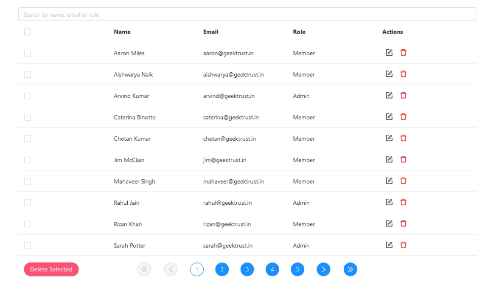
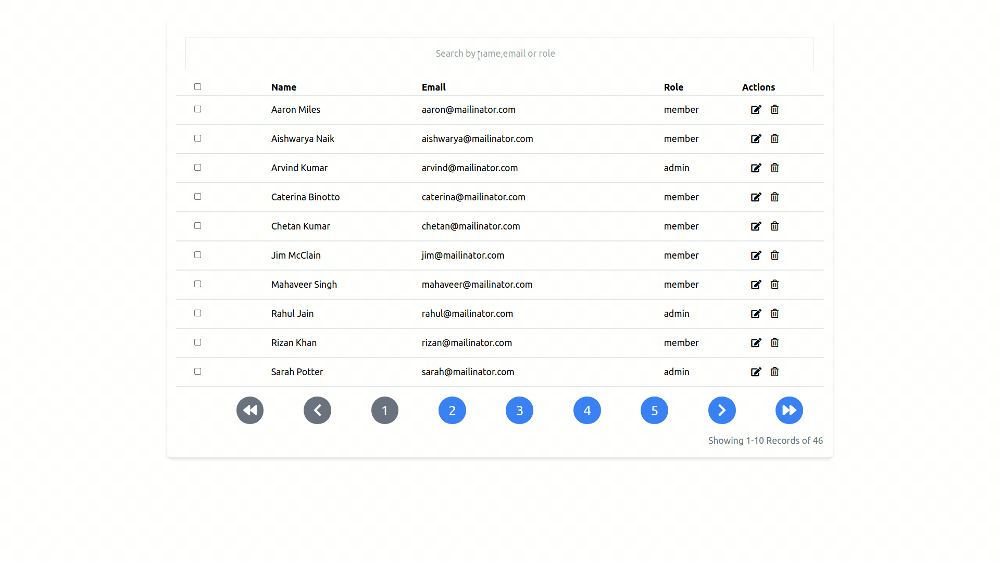

# ADMIN-UI

### The challenge

You work at a startup that is building an interface for admins to see and delete users. The users will be provided via an API. Your job is to build out a working UI. See image below for reference.

### Solution

### Step to Start the App

1. npm install
2. npm start

